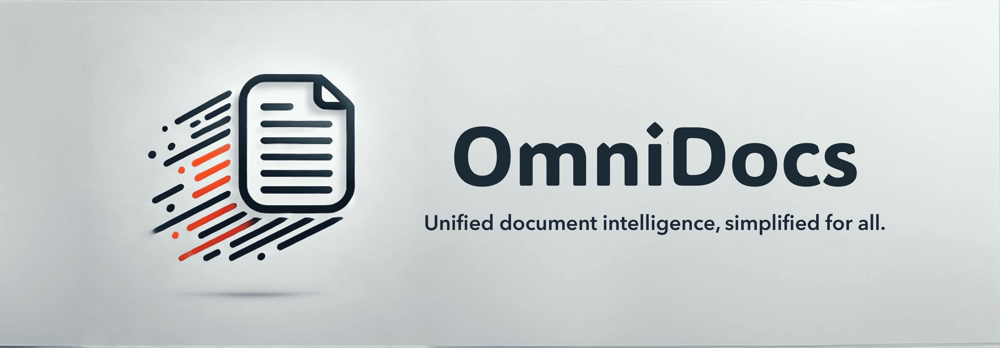

# OmniDocs



<p align="center">
  <b>Unified Python toolkit for visual document understanding</b><br>
  <a href="https://pypi.org/project/omnidocs/"></a>
  <a href="https://github.com/adithya-s-k/OmniDocs/blob/main/LICENSE"></a>
  <a href="https://www.python.org/downloads/"></a>
  <a href="https://deepwiki.com/adithya-s-k/Omnidocs"></a>
</p>

<p align="center">
  <a href="https://adithya-s-k.github.io/Omnidocs/">Documentation</a> •
  <a href="#installation">Installation</a> •
  <a href="#quick-start">Quick Start</a> •
  <a href="#supported-tasks">Tasks</a> •
  <a href="#contributing">Contributing</a>
</p>

---

**OmniDocs** provides a single, consistent API for document AI tasks: layout detection, OCR, text extraction, table parsing, structured extraction, and reading order. Swap models and backends without changing your code.

```python
result = extractor.extract(image)
```

**Why OmniDocs?**

- **One API** — `.extract()` for every task
- **Multi-backend** — PyTorch, VLLM, MLX, API
- **VLM API** — Use any cloud VLM (Gemini, OpenRouter, Azure, OpenAI) with zero GPU
- **Type-safe** — Pydantic configs and outputs
- **Structured extraction** — Extract data into Pydantic schemas
- **Production-ready** — Modal deployment, batch processing

---

## Installation

```bash
pip install omnidocs
```

Or with [uv](https://github.com/astral-sh/uv):

```bash
uv pip install omnidocs
```

Cloud API access (Gemini, OpenRouter, Azure, OpenAI, ANANNAS AI) works out of the box — LiteLLM is included as a core dependency.

<details>
<summary><b>Install extras</b></summary>

```bash
pip install omnidocs[pytorch]   # Local GPU inference
pip install omnidocs[vllm]      # High-throughput production
pip install omnidocs[mlx]       # Apple Silicon
pip install omnidocs[ocr]       # Tesseract, EasyOCR, PaddleOCR
pip install omnidocs[all]       # Everything
```
</details>

<details>
<summary><b>From source</b></summary>

```bash
git clone https://github.com/adithya-s-k/Omnidocs.git
cd Omnidocs
uv sync
```
</details>

<details>
<summary><b>Flash Attention (optional, for PyTorch VLMs)</b></summary>

Download pre-built wheel from [Flash Attention Releases](https://github.com/Dao-AILab/flash-attention/releases):

```bash
# Example: Python 3.12, CUDA 12, PyTorch 2.5
pip install https://github.com/Dao-AILab/flash-attention/releases/download/v2.8.3/flash_attn-2.8.3+cu12torch2.5cxx11abiFALSE-cp312-cp312-linux_x86_64.whl
```
</details>

---

## Quick Start

### VLM API (No GPU Required)

Use any cloud VLM through a single, provider-agnostic API:

```python
from omnidocs.vlm import VLMAPIConfig
from omnidocs.tasks.text_extraction import VLMTextExtractor

# Just set your env var: OPENROUTER_API_KEY, GOOGLE_API_KEY, etc.
config = VLMAPIConfig(model="openrouter/qwen/qwen3-vl-8b-instruct")

extractor = VLMTextExtractor(config=config)
result = extractor.extract("document.png", output_format="markdown")
print(result.content)
```

Works with **any provider**: OpenRouter, Gemini, Azure, OpenAI, ANANNAS AI, self-hosted VLLM — if it speaks the OpenAI API, it works.

### Structured Extraction

Extract typed data directly into Pydantic schemas:

```python
from pydantic import BaseModel
from omnidocs.vlm import VLMAPIConfig
from omnidocs.tasks.structured_extraction import VLMStructuredExtractor

class Invoice(BaseModel):
    vendor: str
    total: float
    items: list[str]

config = VLMAPIConfig(model="gemini/gemini-2.5-flash")
extractor = VLMStructuredExtractor(config=config)

result = extractor.extract(
    image="invoice.png",
    schema=Invoice,
    prompt="Extract invoice details from this document.",
)
print(result.data.vendor, result.data.total)
```

### Text Extraction (Local GPU)

```python
from omnidocs import Document
from omnidocs.tasks.text_extraction import QwenTextExtractor
from omnidocs.tasks.text_extraction.qwen import QwenTextVLLMConfig

doc = Document.from_pdf("report.pdf")

extractor = QwenTextExtractor(
    backend=QwenTextVLLMConfig(model="Qwen/Qwen3-VL-8B-Instruct")
)

result = extractor.extract(doc.get_page(0), output_format="markdown")
print(result.content)
```

### Layout Detection

```python
from omnidocs import Document
from omnidocs.tasks.layout_extraction import DocLayoutYOLO, DocLayoutYOLOConfig

doc = Document.from_pdf("paper.pdf")

detector = DocLayoutYOLO(config=DocLayoutYOLOConfig(device="cuda"))
result = detector.extract(doc.get_page(0))

for box in result.bboxes:
    print(f"{box.label.value}: {box.confidence:.2f}")
```

### Table Extraction

```python
from omnidocs.tasks.table_extraction import TableFormerExtractor, TableFormerConfig

extractor = TableFormerExtractor(config=TableFormerConfig(device="cuda"))
result = extractor.extract(table_image)

df = result.to_dataframe()
html = result.to_html()
```

---

## Supported Tasks

| Task | Description | Output |
|------|-------------|--------|
| **Text Extraction** | Convert documents to Markdown/HTML | Formatted text |
| **Layout Analysis** | Detect titles, tables, figures, etc. | Bounding boxes + labels |
| **OCR** | Extract text with coordinates | Text blocks + positions |
| **Table Extraction** | Parse table structure | Cells, rows, columns |
| **Structured Extraction** | Extract typed data into Pydantic schemas | Validated model instances |
| **Reading Order** | Determine logical reading sequence | Ordered elements |

---

## Supported Models

### Text Extraction

| Model | Backends | Notes |
|-------|----------|-------|
| **VLM API** | Any cloud API | Provider-agnostic via LiteLLM |
| **Qwen3-VL** | PyTorch, VLLM, MLX, API | Best quality |
| **MinerU VL** | PyTorch, VLLM, API | Layout-aware extraction |
| **Nanonets OCR2** | PyTorch, VLLM, MLX | Fast, accurate |
| **Granite Docling** | PyTorch, VLLM, MLX, API | IBM research model |
| **DotsOCR** | PyTorch, VLLM, API | Layout-aware |

### Layout Analysis

| Model | Backends | Notes |
|-------|----------|-------|
| **VLM API** | Any cloud API | Custom labels support |
| **DocLayoutYOLO** | PyTorch | Fast (0.1s/page) |
| **RT-DETR** | PyTorch | Transformer-based |
| **Qwen Layout** | PyTorch, VLLM, MLX, API | Custom labels |
| **MinerU VL Layout** | PyTorch, VLLM, API | High accuracy |

### Structured Extraction

| Model | Backends | Notes |
|-------|----------|-------|
| **VLM API** | Any cloud API | Pydantic schema output |

### OCR

| Model | Backends | Notes |
|-------|----------|-------|
| **Tesseract** | CPU | 100+ languages |
| **EasyOCR** | PyTorch | 80+ languages |
| **PaddleOCR** | PaddlePaddle | CJK optimized |

### Table Extraction

| Model | Backends | Notes |
|-------|----------|-------|
| **TableFormer** | PyTorch | Structure + content |

### Reading Order

| Model | Backends | Notes |
|-------|----------|-------|
| **Rule-based** | CPU | R-tree indexing |

---

## VLM API Providers

Use any VLM through a single config — just change the model string:

```python
from omnidocs.vlm import VLMAPIConfig

# OpenRouter (100+ vision models)
config = VLMAPIConfig(model="openrouter/qwen/qwen3-vl-8b-instruct")

# Google Gemini
config = VLMAPIConfig(model="gemini/gemini-2.5-flash")

# Azure OpenAI
config = VLMAPIConfig(model="azure/gpt-5-mini", api_version="2024-12-01-preview")

# OpenAI
config = VLMAPIConfig(model="openai/gpt-4o")

# Any OpenAI-compatible API (ANANNAS AI, self-hosted VLLM, etc.)
config = VLMAPIConfig(
    model="openai/model-name",
    api_base="https://your-provider.com/v1",
)
```

See the [VLM API docs](https://adithya-s-k.github.io/Omnidocs/latest/usage/models/vlm-api/) for full provider setup and model lists.

---

## Multi-Backend Support

All VLM models support multiple inference backends:

```python
# PyTorch (local GPU)
from omnidocs.tasks.text_extraction.qwen import QwenTextPyTorchConfig
config = QwenTextPyTorchConfig(model="Qwen/Qwen3-VL-8B-Instruct", device="cuda")

# VLLM (high-throughput)
from omnidocs.tasks.text_extraction.qwen import QwenTextVLLMConfig
config = QwenTextVLLMConfig(model="Qwen/Qwen3-VL-8B-Instruct", tensor_parallel_size=2)

# MLX (Apple Silicon)
from omnidocs.tasks.text_extraction.qwen import QwenTextMLXConfig
config = QwenTextMLXConfig(model="mlx-community/Qwen3-VL-8B-Instruct-4bit")

# API (provider-agnostic via litellm)
from omnidocs.tasks.text_extraction.qwen import QwenTextAPIConfig
config = QwenTextAPIConfig(model="openrouter/qwen/qwen3-vl-8b-instruct")
```

---

## Document Loading

```python
from omnidocs import Document

# From file
doc = Document.from_pdf("file.pdf", page_range=(0, 9))

# From URL
doc = Document.from_url("https://arxiv.org/pdf/1706.03762")

# From images
doc = Document.from_images(["page1.png", "page2.png"])

# Access pages
image = doc.get_page(0)  # PIL Image
```

---

## Roadmap

See the full [Roadmap](https://adithya-s-k.github.io/Omnidocs/ROADMAP/) for planned features.

**Coming soon:**
- Math Recognition (LaTeX extraction)
- Chart Understanding
- Surya OCR + Layout

---

## Contributing

Contributions are welcome! See our [Contributing Guide](https://adithya-s-k.github.io/Omnidocs/contributing/) to get started.

```bash
# Setup
git clone https://github.com/adithya-s-k/Omnidocs.git
cd Omnidocs && uv sync

# Test
uv run pytest tests/ -v

# Lint
uv run ruff check . && uv run ruff format .

# Docs
uv run mkdocs serve
```

**Resources:**
- [Development Workflow](https://adithya-s-k.github.io/Omnidocs/contributing/workflow/)
- [Testing Guide](https://adithya-s-k.github.io/Omnidocs/contributing/testing/)
- [Adding Models](https://adithya-s-k.github.io/Omnidocs/contributing/adding-models/)

---

## License

Apache 2.0 — See [LICENSE](LICENSE) for details.

---

<p align="center">
  <a href="https://adithya-s-k.github.io/Omnidocs/">Docs</a> •
  <a href="https://github.com/adithya-s-k/OmniDocs/issues">Issues</a> •
  <a href="https://pypi.org/project/omnidocs/">PyPI</a>
</p>
